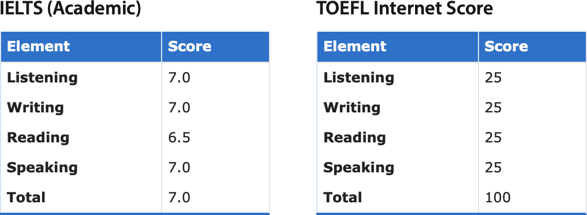

Are you interested in understanding how climate and society changed in the past? Do you have a background in earth sciences, geography, archaeology, or anthropology? Would you like to work with computers, develop your own models and other computer programs? Can you assist with field-based experiential learning for undergraduates? I currently have **short-term research internships** (2-12 months) and **full graduate scholarships** (research master's and Ph.D.) for outstanding candidates from anywhere in the world.

If you are interested in any of the opportunities below, familiarize yourself with my research and get in touch with me [by email](mailto:jed.kaplan@ucalgary.ca). Include your CV and unofficial transcripts and a brief explanation of your research interests. I am open to inquires from prospective applicants from a variety of backgrounds, including geoscience, geography, archaeology, etc., but can only consider students whose research interests align with my own. Get in touch as early as possible: For Canadian applicants and permanent residents, note that NSERC funding applications for graduate scholarships have to be submitted in the autumn of the year before you plan to start your studies.

**NB due to the high number of applications received only shortlisted candidates will be contacted.**

## New November 2025
### Research internships
Please [email me](mailto:jed.kaplan@ucalgary.ca) me the following documents, **combined into a single PDF file**:
  * a one page cover letter explaining why you would like to do an internship and what interests you about working with me
  * a short CV that includes a list of your relevant research skills and background
  * scans of your university transcript(s)
  * scans of your IELTS (Academic) or TOEFL results, _if English is not your mother tongue_

In your email, please indicate the dates you are available and the preferred duration of the internship.

*Current undergraduate students looking for an off-term or final year research experience are particularly encouraged to apply.*

Review of applications will commence on **1 December 2025** and continue until positions are filled.

### Graduate scholarships
**Graduate scholarship (MSc or PhD)** in simulating large scale interactions between forests, peatlands, and wildfires in the boreal forests of Eastern Canada. A background in forestry, geography, earth/environmental sciences, or a related field and an interest in paleoenvironmental reconstruction is desired but all qualified candidates will be considered. **For more information and instructions on how to apply, [contact me](mailto:jed.kaplan@ucalgary.ca) by email**.

### Postdoctoral fellowship
Do you have a burning idea? Are you ready to jump into something new?

I am currently searching for a talented, independent, ambitious early stage researcher for a 2+ year postdoctoral fellowship. While the actual topic of work will be open to agreement between the postdoc and supervisor; candidates with interdisciplinary research interests complementary to mine will have priority. Fields could include:
 - paleoenvironmental reconstruction
 - archaeological reconstruction of past land use systems
 - dynamic vegetation modeling including fire modeling
 - paleoclimate modeling for interesting periods in the Quaternary
 - field-based research on characterizing wildfire fuels using UAV LiDAR and multispectral sensors
 - some combination of the above, or something else I haven’t thought of.

**For more information and instructions on how to apply, [contact me](mailto:jed.kaplan@ucalgary.ca) by email**. Consideration of applications begins 31 January 2025 and will continue until the position is filled.

## Applying for postgraduate study (graduate school)

The University of Calgary Graduate School accepts applications from prospective master's and Ph.D. students every year. For admission in 2026, the next deadline is _15 January 2026_. For details on the application process, click for <a href="https://grad.ucalgary.ca/future-students/explore-programs/geoscience-msc-thesis" target="_blank">M.Sc.</a> or <a href="https://grad.ucalgary.ca/future-students/explore-programs/geoscience-phd" target="_blank">Ph.D.</a> studies.

If you are interested in working with **me**, please [email me](mailto:jed.kaplan@ucalgary.ca) the following documents:
  * a one page statement of **how your research interests relate to my projects and publications**
  * a short CV that includes a list of your relevant research skills and background
  * scans of your university transcript(s)
  * scans of your IELTS (Academic) or TOEFL results, _if English is not your mother tongue_

<!-- I must receive this information by _1 January 2025_.  -->

You'll then need to make a <a href="https://grad.ucalgary.ca/future-students/how-apply" target="_blank">formal application to the University of Calgary Graduate School</a>. 

I welcome applications from prospective interns and graduate students of any gender, nationality, religion, and economic background. You can apply starting in your final year of bachelor studies, and at any level thereafter (holding a bachelor's only or also a master's degree).  Admission to the University of Calgary graduate school is competitive, and good grades from an accredited undergraduate institution are required. If English is not your mother tongue, you'll need to demonstrate your language proficiency. To work with **me**, you'll generally need to be able to meet the following standards (either IELTS **or** TOEFL):

For more information, don't hesitate to [contact me](mailto:jed.kaplan@ucalgary.ca)!
