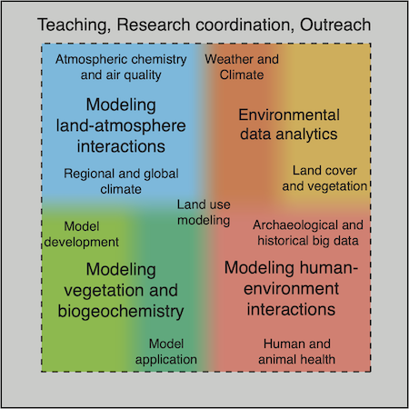

My research interests concentrate on Quaternary environmental history and the role of land cover in influencing global climate. Specifically, I study the way climate change affects land use and land cover, and how these, in turn, affect hydrological cycles, soil, the atmosphere and the built environment. Starting with my broad educational background in earth and environmental sciences, and leveraging that with my interest in programming and high-performance computing, I established myself as a leader in modeling the role of the earth’s land cover in the climate system. I led development of a series of global land surface models: BIOME4, LPJ, and ARVE-DGVM, to address key questions in the role of land cover in the climate system. Today, these models are used not only in my research group, but also by hundreds of researchers around the world to tackle diverse questions about the future of our planet, ranging from air quality to biodiversity, ecosystem services and animal habitats, and to pathways for humanity to adapt land use systems to be resilient in the face of future climate change.

I study the way that climate and human activities affect vegetation and soils and vice versa, and how both of these affect global biogeochemical cycles and ultimately feedback to the climate system. The major unsolved problems my research seeks to address concern the way in which the combination of the natural dynamics of the Earth’s land surface along with human modification of their environment, i.e., land use, might cause, amplify, or attenuate climate change. In this, my research has covered a broad range of topics in environmental science (see figure), and links the natural sciences with the built environment. For example, my ongoing collaborations with climate scientists is leading to new understanding of the way humans modify the earth system to procure ecosystem services, influencing biodiversity, land cover, and climate through their actions, which in turn makes societies either vulnerable or resilient to environmental change. 
My currently funded research encompasses studies on the development and dynamics of vegetation structure and composition, soils, and the global cycles of carbon, water, nutrients and trace gases. In this work, my group and I are exploring how humans affect global and regional land cover and biodiversity, and ultimately climate through modification of the Earth’s land surface (biogeophysical feedbacks) and through emissions of greenhouse gases and aerosols (biogeochemical feedbacks). We further study the role of land cover and land use change in atmospheric chemistry and air quality, and seek to understand how future demands placed on the land, for food, water, and energy may affect human health and well-being.

I employ innovative techniques in numerical modeling and data synthesis based on the models and databases developed in my group. Specific projects I currently lead include: developing a model of global human demographics and anthropogenic land cover change that may be employed to identify sustainable futures; simulating long term change in soil physical and biogeochemical processes using a new dynamic soils model; understanding how land use affects the hydrological cycle and global sediment fluxes; reconstructing climate, land cover and human activities based on sedimentary records; and simulations of how climate change and agriculture perturb the global nitrogen cycle and affect air quality. To tackle these topics, I lead the development state-of-the-art global land use and land cover models (ARVE-DGVM), and a new model of human demographics and interactions with the environment (ALVAR); these models form the basic tools we use for studying the land surface dynamics in many of our research projects.

[Click here](../projects "research projects") for descriptions of a few of my current and past research projects.
